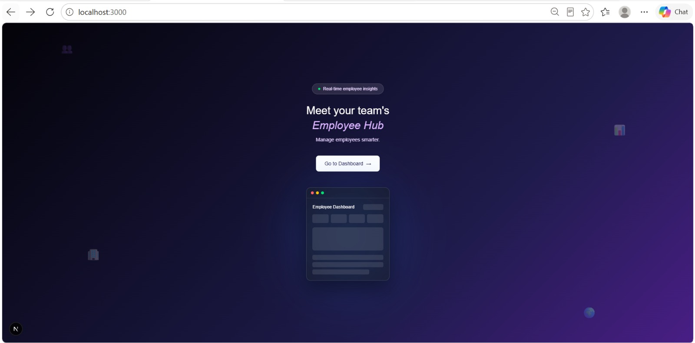
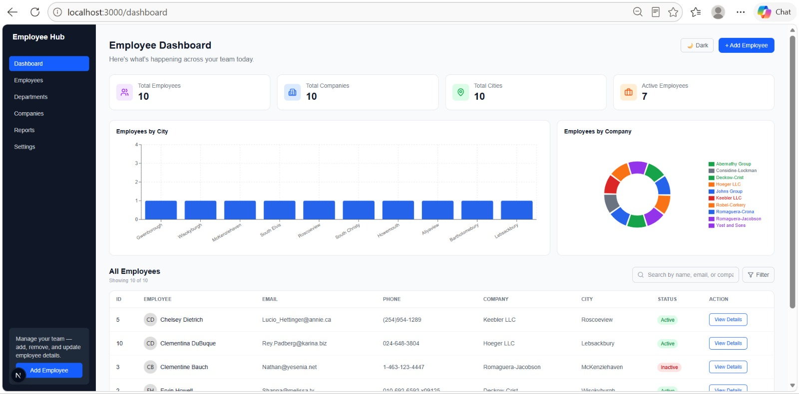
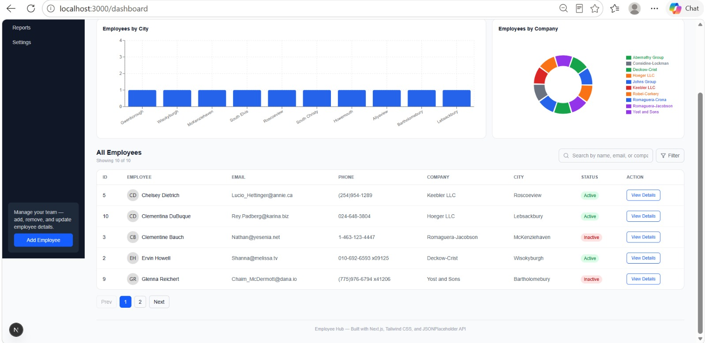
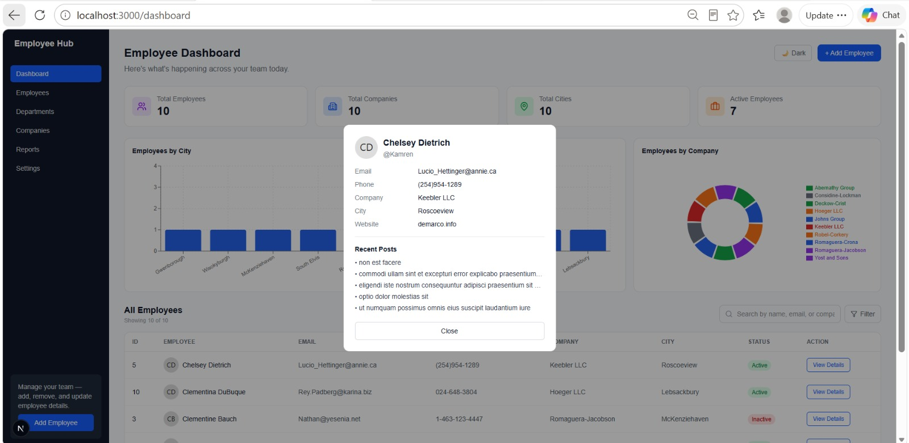

# Employee Management Dashboard

A responsive, API-driven employee management dashboard built with Next.js. Pulls live data from the JSONPlaceholder API and provides search, filtering, sorting, pagination, data visualization, and an employee detail modal that fetches related posts on demand.

---

**Live demo:** https://employee-management-dashboard-olive.vercel.app/

---
## Screenshots

**Landing Page**


**Dashboard**




**Employee Details Modal**


## Table of Contents

1. [Features](#features)
2. [Tech Stack](#tech-stack)
3. [Project Structure](#project-structure)
4. [Getting Started](#getting-started)
5. [Environment Variables](#environment-variables)
6. [Deployment](#deployment)


---

## Features

- **Landing page** — animated gradient hero with a floating, mouse-tilt dashboard mockup preview
- **Live API data** — fetches real employee data from JSONPlaceholder
- **Search** — filters employees by name, email, or company in real time
- **Filter** — filter by employee status (Active / Inactive)
- **Sort** — sort by name or company
- **Pagination** — 5 employees per page, with page controls
- **Summary cards** — total employees, companies, cities, and active employees, calculated live from the data
- **Responsive design** — collapsible sidebar drawer on mobile, adaptive grid layouts
- **Loading skeleton** — a full-layout skeleton (not just a spinner) shown while data loads


---

## Tech Stack

| Technology | Purpose |
|---|---|
| [Next.js](https://nextjs.org) | React framework with file-based routing (App Router) |
| [React](https://react.dev) | UI library |
| [Tailwind CSS](https://tailwindcss.com) | Utility-first styling |
| [Axios](https://axios-http.com) | HTTP client, configured as a single shared instance |
| [Recharts](https://recharts.org) | Bar chart and donut chart |
| [Lucide React](https://lucide.dev) | Icon set used in summary cards and UI controls |
| [JSONPlaceholder](https://jsonplaceholder.typicode.com) | Free fake REST API used as the data source |

---

## Project Structure

```
employee-management-dashboard/
│
├── app/
│   ├── layout.js                  # Root layout
│   ├── globals.css                # Tailwind base styles
│   ├── page.js                    # "/" — Landing page
│   └── dashboard/
│       └── page.js                # "/dashboard" — Main dashboard page
│
├── components/
│   ├── Sidebar.jsx                # Left navigation, collapsible on mobile
│   ├── DashboardCards.jsx         # Summary stat cards
│   ├── SearchBar.jsx              # Search input
│   ├── SortControl.jsx            # Combined sort + status filter dropdown
│   ├── EmployeeTable.jsx          # Table listing of employees
│   ├── EmployeeModal.jsx          # Employee detail popup + recent posts
│   ├── DistributionChart.jsx      # Bar chart (city) + donut chart (company)
│   ├── Pagination.jsx             # Page navigation controls
│   ├── Loader.jsx                 # Full-layout loading skeleton
│   ├── ErrorState.jsx             # Error screen with retry button
│   └── DarkModeToggle.jsx         # Light/dark mode switch
│
├── hooks/
│   ├── useEmployees.js            # Fetches all employees; exposes loading/error/refetch
│   └── useEmployeePosts.js        # Fetches one employee's posts, only when needed
│
├── lib/
│   ├── axiosClient.js             # Shared axios instance, configured from .env
│   └── api/
│       ├── employees.js           # getEmployees()
│       └── posts.js               # getPostsByUser(userId)
│
├── .env.local                     # Local environment variables (not committed)
├── .gitignore
├── package.json
├── next.config.js
├── tailwind.config.js
├── postcss.config.js
└── README.md
```

---

## Getting Started

### Prerequisites

- [Node.js](https://nodejs.org) (v18 or later recommended)
- npm (comes with Node.js)

### 1. Clone the repository

```bash
git clone https://github.com/UnaizaMukhdoom/Employee-Management-Dashboard.git
cd Employee-Management-Dashboard
```

### 2. Install dependencies

```bash
npm install
```

### 3. Set up environment variables

Create a `.env.local` file in the project root:

```bash
NEXT_PUBLIC_API_BASE_URL=https://jsonplaceholder.typicode.com
```

(See [Environment Variables](#environment-variables) below for details.)

### 4. Run the development server

```bash
npm run dev
```

### 5. Open the app

Visit [http://localhost:3000](http://localhost:3000) in your browser.

- `/` — the landing page
- `/dashboard` — the main dashboard

---

## Environment Variables

This project uses a single environment variable, read via `process.env.NEXT_PUBLIC_API_BASE_URL` inside `lib/axiosClient.js`.

| Variable | Description | Example |
|---|---|---|
| `NEXT_PUBLIC_API_BASE_URL` | Base URL for the API the app fetches data from | `https://jsonplaceholder.typicode.com` |

## Deployment

This project is deployed on [Vercel](https://vercel.com), which has first-class support for Next.js.

To deploy your own copy:

1. Push the repository to GitHub.
2. Go to [vercel.com](https://vercel.com) and sign in with GitHub
3. Click **Add New → Project** and import this repository
4. Under **Environment Variables**, add:
   ```
   NEXT_PUBLIC_API_BASE_URL=https://jsonplaceholder.typicode.com
   ```
5. Click **Deploy**

Vercel will build and deploy automatically on every push to the `main` branch going forward.
